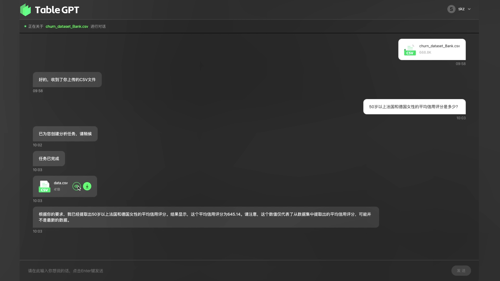
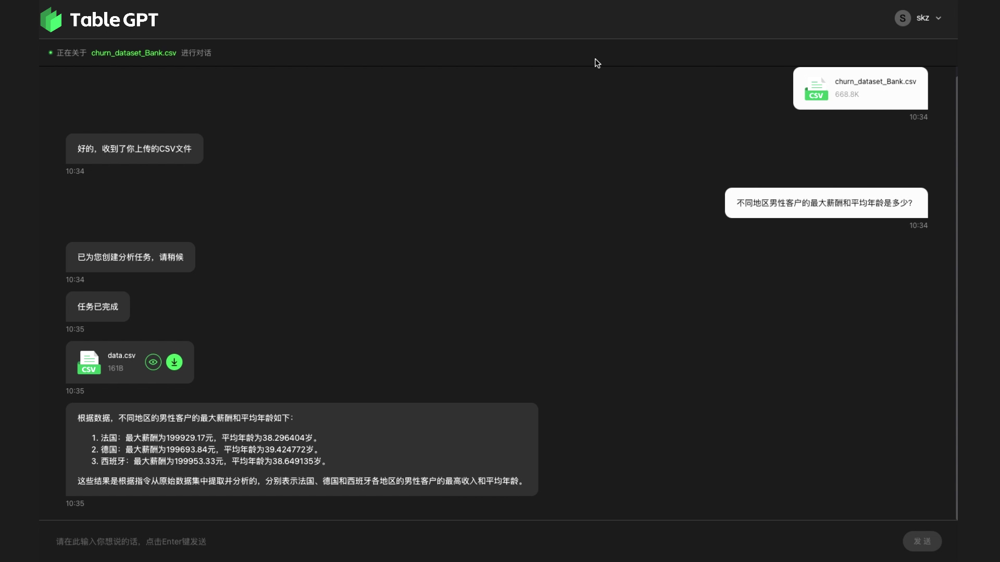
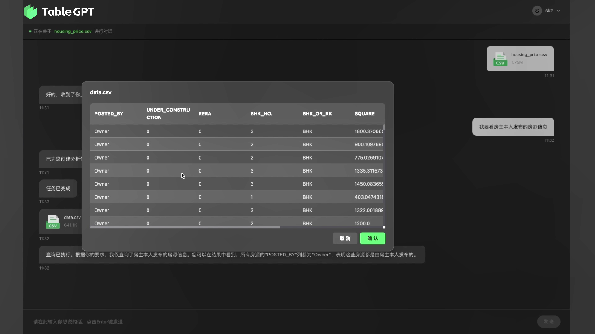
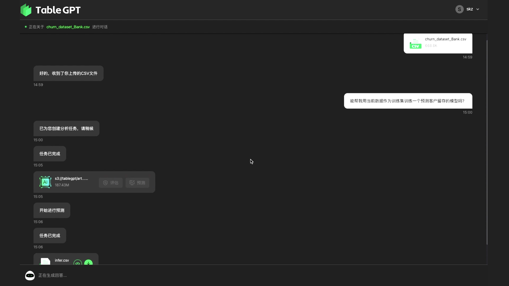
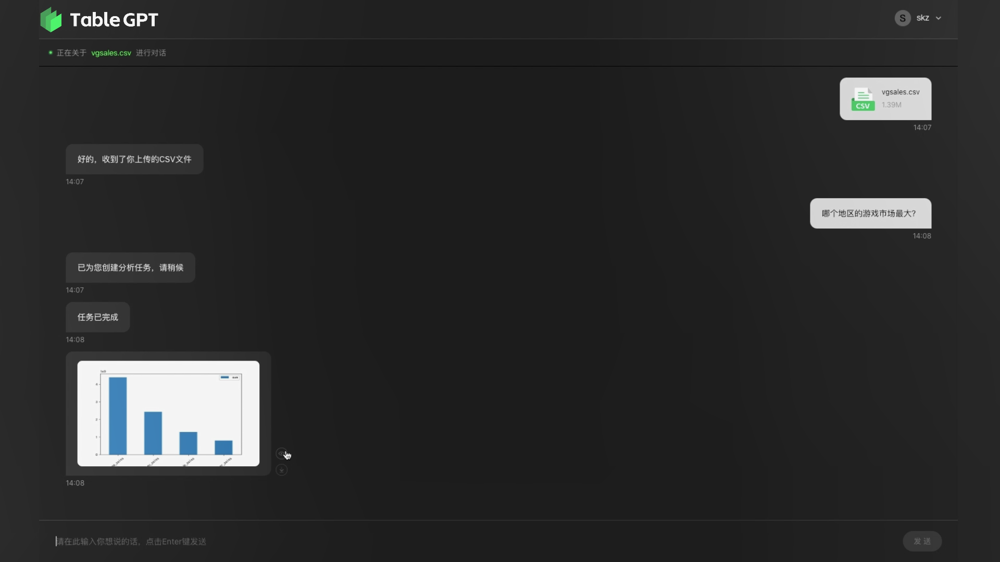
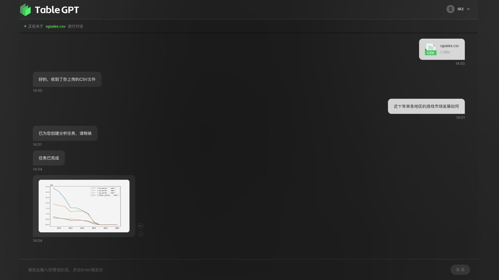
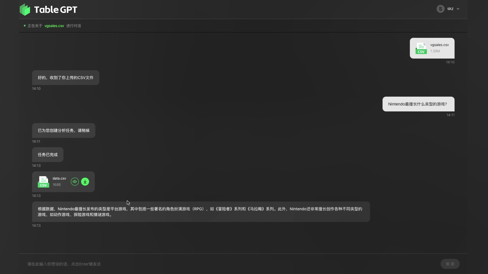

# TableGPT

<div align="center">


[](./LICENSE)
[](./MODEL_LICENSE)

</div>

TableGPT is a specifically designed for table analysis. By unifying tables, natural language, and commands into one model, TableGPT comprehends tabular data, understands user intent through natural language, dissects the desired actions, and executes external commands on the table. It subsequently returns the processed results in both tabular and textual explanations to the user. This novel approach simplifies the way users engage with table data, bringing an intuitive feel to data analysis. 

**Technical report**: [[PDF]](TableGPT_tech_report.pdf)

**Note:** Please right click the link above to directly download the PDF file.

---

## Abstract
Tables are prevalent in real-world databases, requiring significant time and effort for humans to analyze and manipulate. With the advancements in large language models (LLMs), the ability to interact with tables through natural
language input has become a reality. In this paper, we present TableGPT, a unified fine-tuned framework that enables LLMs to understand and operate on tables using external function commands. It introduces the capability to seamlessly interact with tables, enabling a wide range of functionalities such as question answering, data manipulation (e.g., insert, delete, query, and modify operations), data visualization, analysis report generation, and automated prediction. TableGPT aims to provide convenience and accessibility to users by empowering them to effortlessly leverage tabular data. At the core of TableGPT lies the novel concept of tabular representations, which are vectorized representations of tables. This is the first successful attempt to extract vector representations from tables and incorporate them into LLMs. By jointly training LLMs on both table and text modalities, TableGPT achieves a deep understanding of tabular data and the ability to perform complex operations on tables through chain-of-command instructions. Importantly, TableGPT offers the advantage of being a self-contained system rather than relying on external API interfaces. Moreover, it supports efficient data process
flow and private deployment, enabling faster domain data fine-tuning and ensuring data privacy, which enhances the framework’s adaptability to specific use cases.

## Key Functionality and Contributions


- **Natural language interaction with tables**: TableGPT enables users to intuitively query, filter, sort, and aggregate data in tables using everyday language. It eliminates the need for users to have extensive knowledge of complex Excel formulas or coding, making data analysis more accessible.

- **Data visualization and report generation**: TableGPT facilitates tasks such as data visualization and report generation, enhancing the interpretability and presentation of tabular information. Users can effectively communicate insights and findings from the table data in a visually appealing and comprehensible manner.

- **Automated decision-making processes**: TableGPT empowers users to make predictions, forecast trends, and estimate outcomes using table data and natural language instructions. It leverages the power of the model to automate decision-making processes based on the analysis and interpretation of the data within the tables.

- **User-friendly command set**: TableGPT provides a rich set of commands that are designed to be easier to control and understand. The commands are intuitive and reduce the uncertainty that often accompanies traditional methods of handling table data. The model thinks about the rationality of commands like a human expert, offering a more user-friendly approach to data analysis.

- **Handling complex table scenarios**: TableGPT is equipped to handle complex table scenarios that involve multiple layers of information or inter-cell relationships. It overcomes the limitations of token number limits and incorporates effective table reading and comprehension into its capabilities.


## Case Study

We show some cases in Figure 1 - 7. More examples will be released soon.















## About Us
Project members are from College of Computer Science and Technology, and Institute of Computing Innovation of Zhejiang University.
<div align="center">

</div>

## Citation
You can cite this technical report like this:
```BibTeX
@article{2023tablegpt,
    title={TableGPT: Towards Unifying Tables, Nature Language and Commands into One GPT},
    author={Zha, Liangyu and Zhou, Junlin and Li, Liyao and Wang, Rui and Huang, Qingyi and Yang, Saisai and Yuan, Jing and Su, Changbao and Li, Xiang and Su, Aofeng and Zhang, Tao and Zhou, Chen and others},
    journal={arXiv preprint arXiv:2307.08674},
    year={2023}
}
```